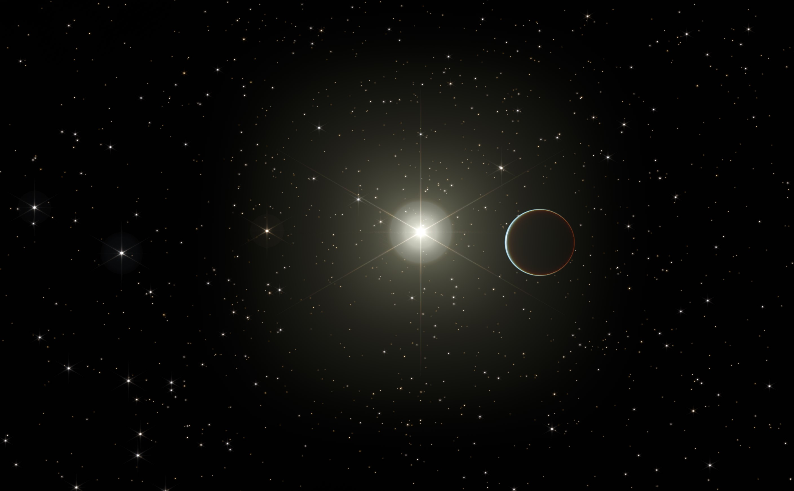

# Starlight for Godot 4.1

(Planet rendered using [Atmosphere Shader v0.4](https://godotengine.org/asset-library/asset/2002))

Starlight is a Godot addon that renders 100 000 stars in realtime, with
low performance cost. It's an alternative to using a skybox, and
also may be relevant to anyone making a space game.

Check out the demo in your web browser: https://tiffnix.com/starlight-demo/

# Features

- Stars are rendered positionally in 3D, allowing you to fly around and
  see stars go by.
- Exact position, luminosity, and temperature of each star can be
  configured by you.
- Physically based light model: Using a [Point Spread Function
  (PSF)][1], rather than a texture that grows or shrinks with
  distance/brightness.
- Based on [MultiMeshInstance3D][2] for performance.
- Uses a trick to avoid being clipped by the far plane, to let stars be
  very far away.
- Works with Forward+, Mobile, and Compatibility renderers.
- Comes with a random star generator based on main sequence stars (classes M through O).

[1]: https://en.wikipedia.org/wiki/Point_spread_function
[2]: https://docs.godotengine.org/en/stable/classes/class_multimeshinstance3d.html

# Usage Guide

To get started, insert `Stars.tscn` into your scene. By default, nothing
will be visible. You can attach the script `StarGenerator.gd` to
randomly generate stars. The default will be 10 000.

## StarGenerator

This script procedurally generates stars in a ball centered on the
origin. It has these properties:

- `size`: Stars are spawned inside of a sphere of this radius.
- `star_count`: The number of stars to create.
- `rng_seed`: The random seed to use when generating stars. Incrementing
  this will give you a different sky.
- `generate_at_origin`: If checked, one extra G-type star will be
  generated exactly at `0, 0, 0`. This can be useful for representing
  the Sun in your scene.

For further customization of the star generator, I recommend editing the
script directly.

## StarManager / Stars.tscn

There is only 1 script property exported, which is which shader to use.
The default points to `Star.gdshader`. You can fork the shader easily by
changing this.

The script also forwards the shader parameters which you can edit
directly.

If you want to load your own star catalog, or use a custom random star
generator, you will need to call `set_star_list()` with an array of `Star`.

The Star constructor takes 3 arguments:

1. `position`: 3D position in model space units.
2. `luminosity`: Luminosity in [solar luminosity][3]. Approximately 1.0 for Sol.
3. `temperature`: [Effective temperature][4] in Kelvin. Approximately 5778 for Sol.

[3]: https://en.wikipedia.org/wiki/Solar_luminosity
[4]: https://en.wikipedia.org/wiki/Effective_temperature

## Star.gdshader

The following visual properties are exposed:

- `emission_energy` - Multiplier for how bright stars should be.
  Generally this is some extremely large number like `500000000` -
  you'll need to add or remove zeros until it looks right.
- `color_gamma` - How strongly colors should show through. A value of 1
  should be close to real life, while a very high value of 5-10
  resembles what you see in false-color images from telescopes. A value
  of 3 or 4 is a good balance.
- `billboard_size_deg` - This controls how much of the screen the PSF
  texture takes up, in degrees. For the default JWST PSF I recommend a
  value of around 90.
- `meters_per_lightyear` - This is a scaling setting, you'll need to set
  it depending on how far away you want your stars to be.
- `luminosity_cap` - This is the maximum brightness a star can have. The
  main usage of this is to prevent the PSF texture from being blown out
  and showing as a white square. This mainly happens when very close to
  stars.
- `texture_emission` - This is the actual PSF texture. The default one
  is the PSF from the James Webb Space Telescope, because it looks cool.
  There are a few others in the `psf-textures` folder which can be used
  instead.
- `clamp_output` - Clamps the output from 0 to 1 when enabled. Can be
  useful depending on how your HDR is setup.

In order to have good performance, the PSF texture needs to be cropped
depending on how bright the star is on screen. The majority of stars
only appear as a couple of pixels in size, as opposed to covering almost
the entire screen for a star you're very close to. This cropping
behavior directly affects how much overdraw there is, which can
massively impact performance. You will need to adjust these properties
if you change the PSF texture from the default JWST one. To control this
behavior, the shader has these properties:

- `min_size_ratio` - This is the minimum size that a star can render at.
  This corresponds to the innermost bright spot of the PSF texture, and
  is usually a very small value like 0.003.
- `max_luminosity` - This is the point at which the cropping stops and
  the full PSF texture is used. To set this value, try to find the point
  at which the PSF texture is fully visible, specifically things like
  diffraction spikes reach the edge of the texture. Then adjust
  max_luminosity until it's just below that point.
- `scaling_gamma` - Diffraction spikes usually fall in brightness
  according to distance^2 from the center of the texture, which means a
  value of 0.5 is ideal. You may need to use other values depending on
  your PSF texture. For a perfect airy disk in particular, the falloff
  is faster than quadratic.
- `debug_show_rects` - This can be useful while tweaking any of these
  values. It helps visualize whether any stars are being over-cropped,
  or if there is too much overdraw in your scene.

Be careful when tweaking these values. You may want to reduce the star
count to something more manageable like 1000 or 10,000 while doing this.
Setting `scaling_gamma` to 0 by accident, for example, can crash Godot,
your graphics drivers, or even your entire PC.

The shader also requires knowledge of the camera FOV to work correctly.
StarManager tries to automatically find the Camera3D of the current
viewport, but in some cases this auto-detection may be wrong, and you
will need to edit StarManager.gd for your needs. It also does not
display correctly in the editor due to it using different FOV settings
from the scene.

# Credit

Code is released under [MIT license](./LICENSE.md).

The default PSF texture, `jwst.exr`, is based on FITS data [obtained
from here][3]. Code for cropping, downscaling, and converting to OpenEXR
is located in `docs/fits2exr.py`.

The alternative PSF textures `hst.exr`, `hex_aperture.exr`, and
`airy_disk.exr` were created using [Poppy][4] based on examples in the
documentation. Code is located in `docs/poppy psfs.ipynb`.

[3]: https://www.stsci.edu/jwst/science-planning/proposal-planning-toolbox/simulated-data
[4]: https://poppy-optics.readthedocs.io/en/latest/
